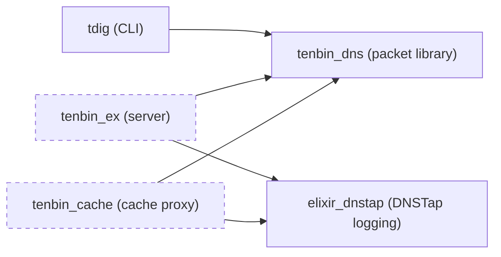

# 下川研究室 (smkwlab)

**九州産業大学 理工学部 情報科学科 下川研究室**のソフトウェア開発・教育基盤の組織アカウントです。
研究で開発している DNS/Elixir ソフトウェア群と、卒業論文・レポート作成を支える LaTeX 文書基盤、そしてそれらを横断する CI / AI レビュー基盤を公開しています。

---

## 🌐 DNS / Elixir エコシステム

Elixir/OTP で実装した DNS ソフトウェア群です。低レベルのパケット処理ライブラリを土台に、CLI ツール・サーバー・ロギング基盤を組み合わせられる構成になっています。

> 破線のノード（`tenbin_ex` / `tenbin_cache`）は研究用途で開発中のサーバーコンポーネントで、現在は非公開です。

### ユースケース別の選び方

| やりたいこと | プロジェクト | 公開状況 |
|---|---|---|
| DNS パケットを Elixir で解析・生成したい | [**tenbin_dns**](https://github.com/smkwlab/tenbin_dns) — 19+ レコードタイプ・DNSSEC・EDNS0 対応のパース/生成ライブラリ | ✅ 公開 |
| コマンドラインで DNS を引きたい（`dig` 互換） | [**tdig**](https://github.com/smkwlab/tdig) — dig 互換出力の CLI。ビルド済みバイナリ配布あり | ✅ 公開 |
| DNSTap ロギングを組み込みたい | [**elixir_dnstap**](https://github.com/smkwlab/elixir_dnstap) — Frame Streams 対応の DNSTap ロギングライブラリ（Hex 公開） | ✅ 公開 |
| ポリシーベースの DNS サーバーを動かしたい | **tenbin_ex** — 動的応答ポリシーを差し込める権威サーバー | 🔒 研究用（非公開） |
| 透過型 DNS キャッシュプロキシが欲しい | **tenbin_cache** — 無加工転送に特化した薄いキャッシュプロキシ | 🔒 研究用（非公開） |

---

## 📄 LaTeX 文書エコシステム

卒業論文・修士論文・演習レポート・ポスターを、再現性のある環境で作成し、PR ベースのレビューと自動 PDF ビルドに載せるための基盤です。

| プロジェクト | 役割 |
|---|---|
| [latex-ecosystem](https://github.com/smkwlab/latex-ecosystem) | LaTeX テンプレート群とツールの全体管理 |
| [latex-environment](https://github.com/smkwlab/latex-environment) | Dev Container ベースの再現可能な TeX 執筆環境 |
| [latex-template](https://github.com/smkwlab/latex-template) | 汎用 LaTeX ドキュメントテンプレート |
| [sotsuron-template](https://github.com/smkwlab/sotsuron-template) | 卒業論文テンプレート（draft ブランチ運用） |
| [poster-template](https://github.com/smkwlab/poster-template) | 学会発表用 A0 ポスターテンプレート（tikzposter・日本語対応） |
| [ise-report-template](https://github.com/smkwlab/ise-report-template) | 情報科学演習レポート用テンプレート（HTML5） |
| [latex-release-action](https://github.com/smkwlab/latex-release-action) | LaTeX ビルド & PDF リリースを自動化する GitHub Action |
| [split-sentences](https://github.com/smkwlab/split-sentences) | LaTeX 文書を 1 文 1 行に整形し diff を見やすくするツール |

---

## ⚙️ 開発・教育基盤

複数リポジトリ・多数の学生リポジトリに共通機能を配布・運用するための仕組みと、演習用の開発環境です。

| プロジェクト | 役割 |
|---|---|
| [.github](https://github.com/smkwlab/.github) | org 共通の Reusable Workflows（CI・LaTeX ビルド・AI レビュー・ML 通知 等）と community health files |
| [thesis-management-tools](https://github.com/smkwlab/thesis-management-tools) | 論文・レポート管理を支援する教員・管理者向けツール群 |
| [ise-report](https://github.com/smkwlab/ise-report) | 情報科学演習レポートの進捗ダッシュボード |
| [atcoder-env](https://github.com/smkwlab/atcoder-env) | AtCoder 参加用の Dev Container 環境。VS Code で開くと acc / oj や独自タスク込みの環境が構築され、新規コンテスト作成・テスト・提出まで完結（学生の競プロ演習向け） |
| [atcoder-container](https://github.com/smkwlab/atcoder-container) | atcoder-env が利用する AtCoder 用コンテナイメージ。9 言語（Java/Python/C++/Rust/Ruby/Elixir/Erlang/JS）＋AC Library 等の競技用ライブラリ込み、lite / full の 2 版を提供 |

---

## 🚀 各プロジェクトの始め方

公開プロジェクトの README には、3 ステップで動作確認できる **Quick Start** を用意しています。各リポジトリの README 冒頭を参照してください。

- DNS ライブラリ／ツール: [tenbin_dns](https://github.com/smkwlab/tenbin_dns) / [tdig](https://github.com/smkwlab/tdig) / [elixir_dnstap](https://github.com/smkwlab/elixir_dnstap)
- LaTeX 執筆環境: [latex-environment](https://github.com/smkwlab/latex-environment) → 各テンプレート
- 競技プログラミング: [atcoder-env](https://github.com/smkwlab/atcoder-env) を VS Code で開く

## 🛠 共通開発規約

- **ブランチ**: 機能ごとに feature ブランチを作成（英語・説明的な名前）
- **コミット / PR / Issue タイトル**: 英語
- **CI**: `.github` の Reusable Workflows を各リポジトリから参照（Elixir CI・security 監査・AI コードレビュー 等）
- **Elixir プロジェクトの品質ゲート**: `mix format` / `mix test` / `mix credo --strict`（Lefthook でコミット時に自動実行）

ワークフローの利用方法・バージョニング規約は [.github リポジトリの README](https://github.com/smkwlab/.github) を参照してください。

## 📜 ライセンス

各リポジトリのライセンス表記に従います（DNS/Elixir 群は BSD 3-Clause 等、リポジトリごとに `LICENSE` を確認してください）。
